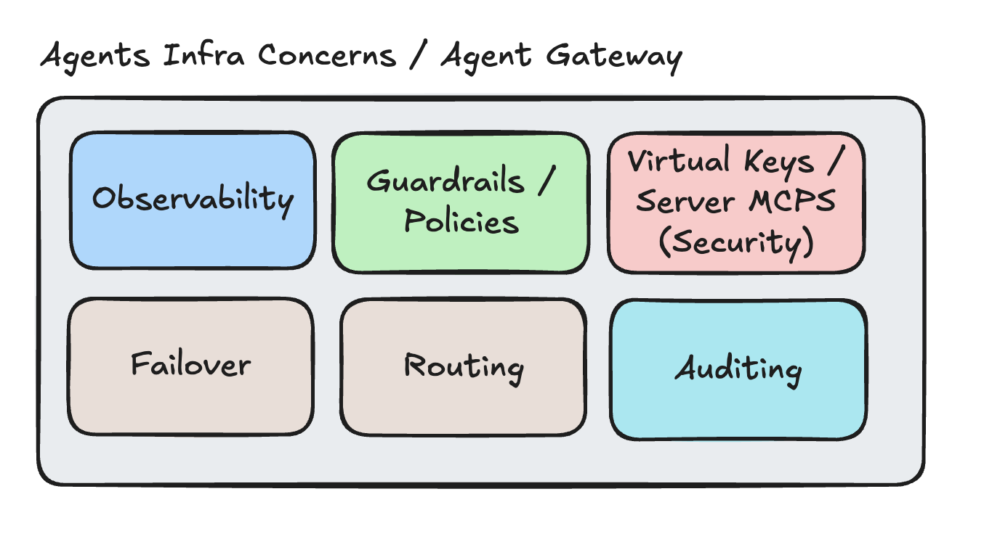

# AI Agent Gateway

Concerns:



Comparison of tools:

```
┌─────────────────────────┬─────────────────────────────────────────────────────────────────────────────────────┐
│         Concern         │                                        Tools                                        │
├─────────────────────────┼─────────────────────────────────────────────────────────────────────────────────────┤
│ Full Gateway            │ Portkey, LiteLLM Proxy, Kong AI Gateway, Cloudflare AI Gateway                      │
├─────────────────────────┼─────────────────────────────────────────────────────────────────────────────────────┤
│ Routing                 │ RouterLLM, OpenRouter, LiteLLM, Portkey, Martian                                    │
├─────────────────────────┼─────────────────────────────────────────────────────────────────────────────────────┤
│ Failover                │ LiteLLM (fallbacks), Portkey, OpenRouter                                            │
├─────────────────────────┼─────────────────────────────────────────────────────────────────────────────────────┤
│ Observability           │ Langfuse, Helicone, Arize Phoenix, Braintrust, Portkey                              │
├─────────────────────────┼─────────────────────────────────────────────────────────────────────────────────────┤
│ Guardrails / Policies   │ NeMo Guardrails (NVIDIA), Guardrails.ai, Aporia, LlamaGuard, AWS Bedrock Guardrails │
├─────────────────────────┼─────────────────────────────────────────────────────────────────────────────────────┤
│ Virtual Keys / Security │ Portkey (best here), LiteLLM, Kong                                                  │
├─────────────────────────┼─────────────────────────────────────────────────────────────────────────────────────┤
│ Auditing                │ Langfuse, Helicone, Portkey                                                         │
└─────────────────────────┴─────────────────────────────────────────────────────────────────────────────────────┘
```

More conncerns:

- Rate Limiting / Budget Controls - per team, per agent cost caps
- Caching - semantic caching reduces cost significantly
- PII / Data Redaction - before calls hit the LLM (distinct from guardrails)
- Load Balancing - across instances of the same provider
- Authentication / AuthZ - which agent/team can call what