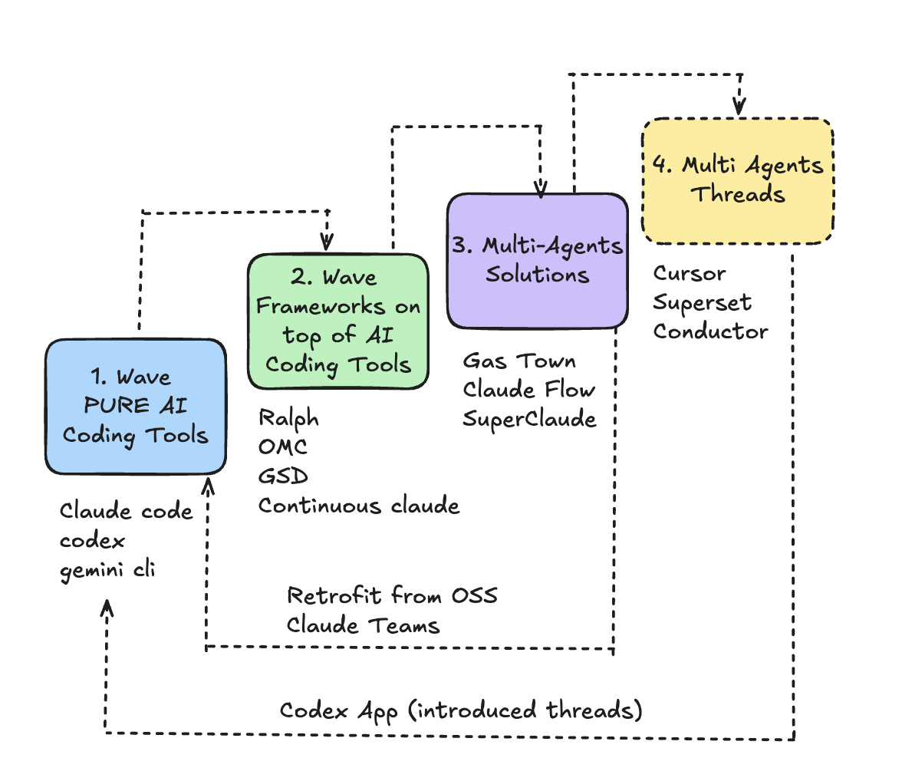
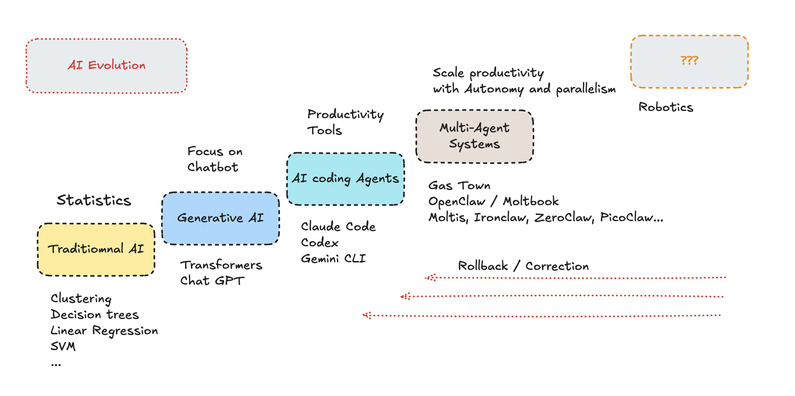

# AI coding Agents Evolution

No necessary in perfect timeline order, but we can see the evolution of AI coding agents in 4 waves, with some retrofitting in between.

# Wave 1 - Pure AI coding Tools

Claude code, Codex and gemini CLI.

## Wave 2 - Frameworks on top of AI Coding Tools

Ralph, OMC, GSD, Conntinnous Claude

## Wave 3 - Multi-Agent Solutions

Gast Towm, Claude Flow, Superclaude

## Wave 4 - Threads

Cursor, Superset and Conductor.

## Retrofit 

Claude Teams -> Multi-agents like Claude Flow, Gast Town, Superclaude
Codex App -> Threads like Cursor, Superset and Conductor.

## AI Evolution

Here is a bigger picture of evolution of AI. No boddy knows the future but my guess (as 2026) it's robotics. Perhaps there will be a correction or slice rollback, I said that in 2025. 

Why Rollback?
* Hype = Unrealist Spectations
* No more Data (Synthetic data dont work well in all domains)
* Throwing more hardware does not do the trick anymore (Deminishing returns)
* We still rely on training, LLMs still cannot learn
* Token usage keeps increasing
* Models keep getting more expensive
* Rearchers dont see a way out unless there isa breaktought
* we already talling since last tyear and changes are incremental
* What happens if is not sustainable? (like crypto, web3, metaverse)
* What happens when company realize they will not get 100x or even 10x so easily as productivity gains?
* Last year(2025) everyboddy want to get rid of juniors, this year is the middle level - wgat will be next year? eveyboddy hiring again :D 
* Anti-AI Movements keep growing