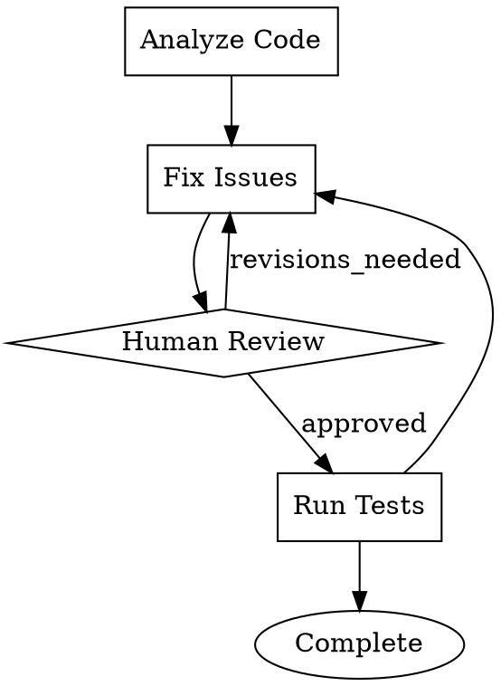

# StrongDM Attractor

## 1. What is it?

Attractor is an open-source, non-interactive coding agent specification created by StrongDM, designed for use in software factories. Rather than shipping a runnable framework or library, Attractor provides NLSpecs (Natural Language Specifications) that describe how to build a DOT-based pipeline runner, a coding agent loop, and a unified LLM client. You feed these specs to any modern coding agent (Claude Code, Codex, Cursor, etc.) and it builds the system for you. The core idea is that AI workflows are directed graphs defined in Graphviz DOT syntax, where nodes are tasks (LLM calls, human reviews, conditional branches, parallel fan-outs) and edges define the flow between them.

- Language: Language-agnostic (specs, not code). Community implementations exist in Go, Rust, TypeScript, Python, Ruby
- License: Apache 2.0
- GitHub: github.com/strongdm/attractor (554+ stars, 72 forks)
- Website: factory.strongdm.ai/products/attractor
- Released: February 2026

## 2. Main Features

- DOT-based pipeline definition: workflows are Graphviz digraphs where nodes are stages and edges are transitions, making pipelines visual, diffable, and version-controllable
- Node handler system: pluggable handlers for LLM calls (codergen), human-in-the-loop gates, conditional branches, parallel fan-out/fan-in, and custom node types via a common interface
- Checkpoint and resume: after each node completes the engine saves a serializable checkpoint, allowing crash recovery and resumption from the last completed node
- Human-in-the-loop (Interviewer Pattern): pipelines can pause at designated nodes, present choices to a human operator, and route based on the decision for approval gates and code review
- Model stylesheet: CSS-like syntax for assigning LLM models and providers to nodes based on selectors, so different stages can use different models
- Edge-based routing: transitions controlled by conditions, labels, and weights evaluated at runtime using a condition expression language
- Parallel execution: subgraph-based fan-out where multiple nodes execute concurrently with configurable join semantics
- Coding Agent Loop spec: a separate language-agnostic specification for building an autonomous coding agent with provider-aligned toolsets (OpenAI/codex, Anthropic/Claude Code, Gemini/CLI patterns), event-driven architecture, subagent spawning, and mid-task steering
- Unified LLM Client spec: a four-layer architecture for a provider-agnostic LLM SDK supporting OpenAI, Anthropic, Gemini with streaming, tool calling, middleware, and automatic retries
- Event-driven architecture: every pipeline action emits typed events for TUI, web, and IDE frontends
- Validation and linting: built-in DOT file validation with typed attributes, BNF grammar, and constraint checking
- Context fidelity modes: configurable context management for controlling how much state flows between nodes
- Retry and goal gates: configurable retry ceilings per node with jump-to-target semantics when goals are not met
- Transform and extensibility hooks: pipeline-level transforms for pre/post processing

## 3. Pros

- Spec-first approach: you own the implementation entirely, no vendor lock-in to a specific runtime or language
- Graphviz DOT is a natural fit: workflows are graphs, DOT is a graph language, and existing tooling (renderers, editors, linters) works out of the box
- Visual by default: any pipeline can be rendered to SVG/PNG for immediate feedback, code review, and documentation
- Language-agnostic: the specs are implementable in any language, and the community has already built versions in Go, Rust, TypeScript, Python, and Ruby
- Deterministic execution: given identical inputs, the pipeline produces identical outputs, critical for software factory reliability
- Observable: every node transition is an observable event, enabling deep debugging and monitoring
- Composable: graphs can be composed with other graphs, enabling modular workflow construction
- Human-in-the-loop as a first-class primitive: not bolted on, but designed into the core pipeline model
- Comprehensive specs: the three NLSpecs (Attractor, Coding Agent Loop, Unified LLM Client) cover the full stack from LLM communication to workflow orchestration
- Provider-aligned toolsets: the coding agent spec respects that each LLM provider has its own optimal tool/prompt patterns rather than forcing a universal approach

## 4. Cons

- Not a runnable framework: you must build the implementation yourself (or have a coding agent build it), which is a higher barrier to entry than pip install
- Very new: released February 2026, the spec and community implementations are still maturing
- No official reference implementation: StrongDM provides specs but not a canonical codebase, so implementations may diverge
- DOT syntax limitations: while powerful for graphs, DOT is not designed for complex data structures, so node configuration relies on string attributes with typed parsing
- Complexity overhead: the full spec (pipeline engine + coding agent loop + unified LLM client) is substantial to implement correctly from scratch
- No built-in memory system: unlike CrewAI or Strands Agents, there is no short-term/long-term/entity memory abstraction in the spec
- No tool ecosystem: no pre-built tool marketplace, each implementation must bring its own tools
- No visual builder or studio: pipeline authoring requires writing DOT files by hand
- Community fragmentation risk: multiple independent implementations in different languages may lead to inconsistencies

## 5. Comparison

| Aspect | StrongDM Attractor | CrewAI | Strands Agents | LangChain/LangGraph | Spring AI |
|---|---|---|---|---|---|
| Language | Any (spec-based) | Python | Python, TypeScript | Python, JS/TS | Java (Spring Boot) |
| Architecture | DOT graph pipelines | Role-based crews + flows | Model-driven agentic loop | Graph-based DAGs | Spring Boot patterns |
| Artifact | NLSpec (build your own) | Runnable framework | Runnable SDK | Runnable framework | Runnable framework |
| Pipeline Definition | Graphviz DOT files | Python code | Python code | Python code | Java code |
| Multi-Agent | Graph nodes + subagents | Crew hierarchies, delegation | Graph, Swarm, Workflow, A2A | LangGraph nodes/edges | Orchestrator-Worker |
| Human-in-the-Loop | First-class (Interviewer Pattern) | Built-in support | Supported | Supported via interrupt | Limited |
| MCP Support | Not in spec (bring your own) | Limited | Native, first-class | Via integration | Limited |
| LLM Provider Support | Any (via Unified LLM Client spec) | OpenAI, Anthropic, Google, etc. | Bedrock, OpenAI, Gemini, etc. | Many providers | Many providers |
| Checkpoint/Resume | First-class (per-node) | Not built-in | Not built-in | State checkpointing | Not built-in |
| Maturity | Spec released Feb 2026 | v1.9.3, production GA | Open sourced May 2025 | Established since 2022 | 1.0 GA May 2025 |
| Best For | Custom software factories, full-stack control | Rapid multi-agent prototyping | AWS-native agent dev | Complex chains with many integrations | Java/Spring enterprise |

## 6. Why is it unique?

Attractor is unique because it is a specification, not a framework. Instead of shipping a library you import, StrongDM published three NLSpecs that describe the complete architecture of a DOT-based pipeline runner, a coding agent loop, and a unified LLM client. You feed these specs to a coding agent and it builds the system in whatever language you want. This is a radical departure from every other agent framework (CrewAI, LangChain, Strands) which ship runnable code. The DOT-based pipeline definition is also distinctive: workflows are literal Graphviz directed graphs that can be rendered, diffed, and version-controlled as visual artifacts. The separation between pipeline orchestration (Attractor), coding agent behavior (Coding Agent Loop), and LLM communication (Unified LLM Client) gives implementors full control over each layer independently. The philosophy is that a software factory should own its entire stack, not depend on a third-party runtime that could change underneath you.

## 7. Simple Usage

Define a pipeline as a DOT file:



Build Attractor from the spec using a coding agent:

```
codeagent> Implement Attractor as described by https://factory.strongdm.ai/
```

Run the pipeline (once implemented):

```bash
attractor run code_review.dot --goal "Review and improve the authentication module"
```
