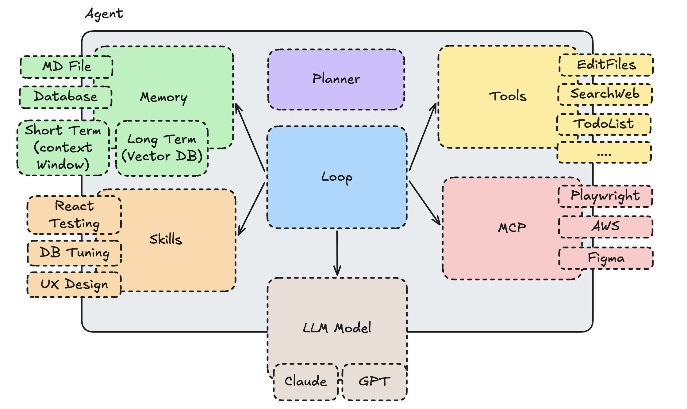
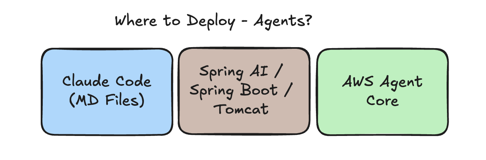

# Agent

Google Definition:
1. a person who acts on behalf of another person or group.
2. a person or thing that takes an active role or produces a specified effect.

IMHO a agent is type of system that perform a task for us, it could be semi-autonomous with the human in the loop or fully autonomous without human intervention. The main goal of an agent is to perform a task or achieve a goal on behalf of the user.

## Agent Anatomy

Not all agents are create equals, they can be a simple markdown file or it could be a complex program where engineering and AI blend together to create a powerful agent. The anatomy of an agent can be broken down into several components:

## Where to Deploy agents?

Agents are software and can be deployed in various environments, depending on their purpose and requirements. Some common deployment environments:

