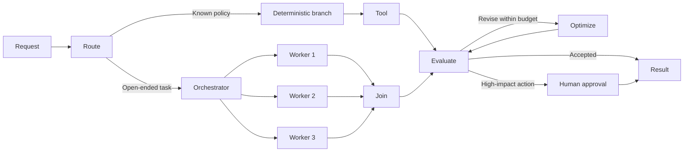
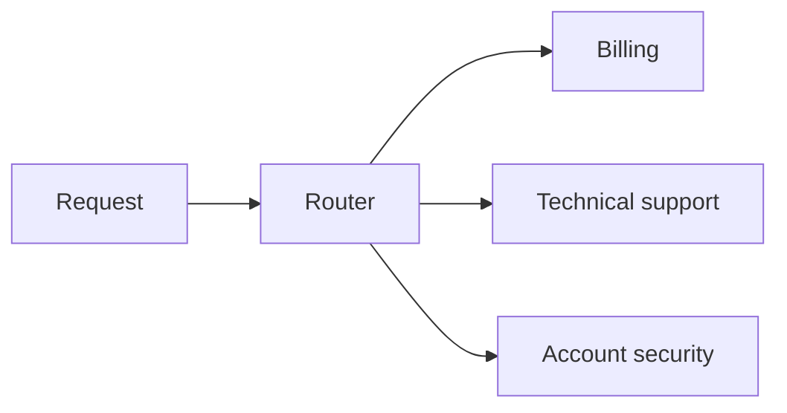
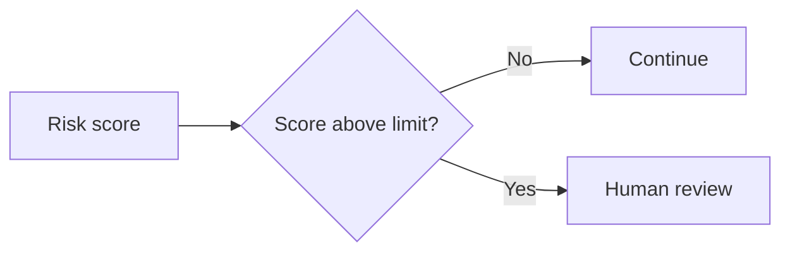
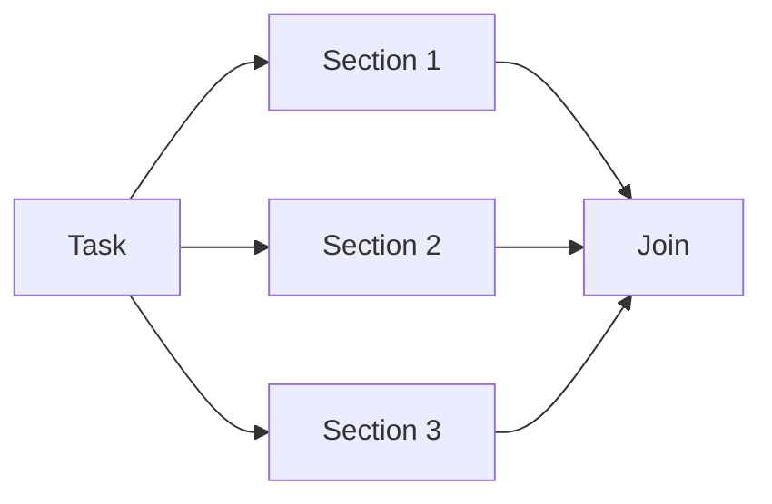
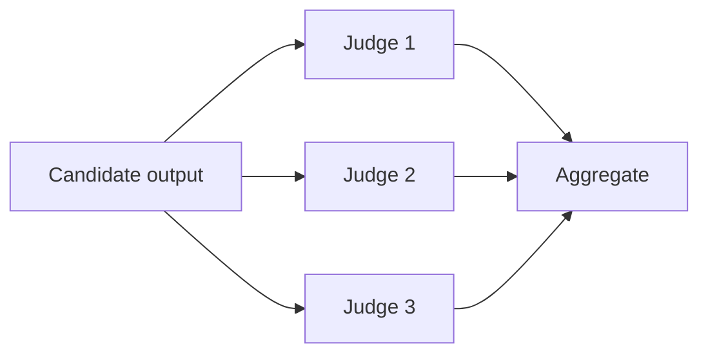
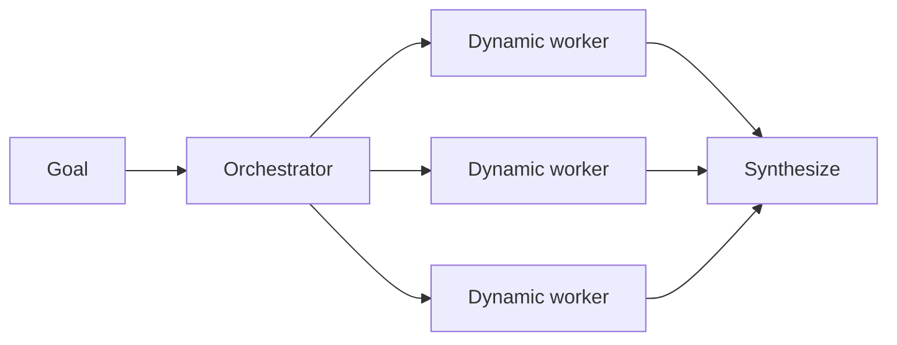
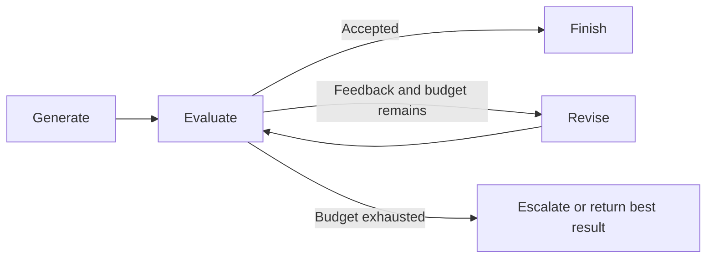
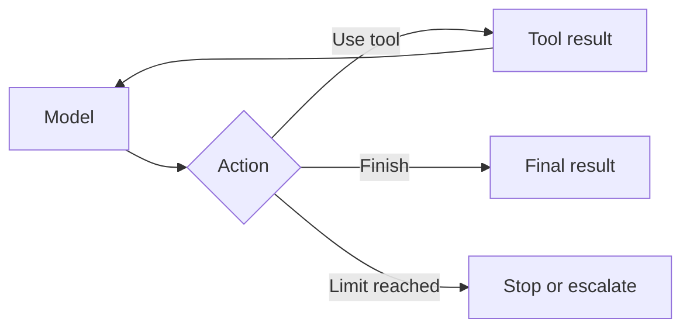

# AI Agents: Workflow Patterns

Research verified on August 11, 2026.

## What is a workflow pattern?

An AI workflow is a controlled path through model calls, deterministic code, tools, data, and human decisions. Its path is mostly defined by software. An agent is more dynamic: the model decides which steps and tools to use while working toward a goal. Anthropic uses this same distinction between predefined workflows and model-directed agents in [Building effective agents](https://www.anthropic.com/engineering/building-effective-agents).

The two approaches are complementary. A production system usually places bounded agent loops inside a deterministic workflow so that flexible reasoning is surrounded by explicit permissions, budgets, checkpoints, and acceptance criteria.

## Workflow visualization as a graph

A graph is the clearest representation of an AI workflow:

- Nodes are models, functions, tools, workers, evaluators, or human gates.
- Edges are sequences, routes, conditions, fan-outs, joins, retries, or exits.
- State is the typed data and artifacts carried between nodes.
- The execution trace is the path taken through the graph during one run.



The declared graph shows every allowed path. The trace shows what actually happened. This distinction matters because an agent may dynamically choose tools or create worker tasks even though the outer safety envelope remains fixed. LangGraph formalizes graphs as shared state, nodes, and edges, including conditional edges and parallel destinations in its [Graph API](https://langchain-ai.github.io/langgraph/how-tos/state-reducers/).

## Pattern selection

| Pattern | Control decision | Best fit | Main advantage | Main cost or risk |
|---|---|---|---|---|
| Routing | Classifier, rules, or model | Distinct request categories | Specialized context and tools | Misclassification sends work down the wrong path |
| Branching | Deterministic condition | Explicit business rules | Predictable and testable | Rule count can grow quickly |
| Parallel sectioning | Predefined decomposition | Independent subtasks | Lower wall-clock latency | Join and partial-failure handling |
| Parallel voting | Aggregator or threshold | Independent judgments | Higher confidence on uncertain decisions | Correlated mistakes and higher model cost |
| Concurrency | Runtime scheduler | I/O-heavy overlapping work | Better throughput and responsiveness | Rate limits, races, cancellation, backpressure |
| Orchestrator/workers | Model or planner | Unknown subtasks | Dynamic decomposition | Coordinator bottleneck and context loss |
| Evaluator/optimizer | Rubric, tests, or judge | Outputs improved by feedback | Iterative quality improvement | Endless refinement or judge bias |
| Looping | Model plus stop policy | Open-ended tool use | Adaptation from observations | Runaway cost and compounding errors |
| Tool use | Model selects a typed capability | External data or action | Grounds output and changes state | Security, validation, and side effects |

## Routing

Routing classifies an input and sends it to one or more specialized destinations.



Use routing when categories require different prompts, tools, models, permissions, or owners. Use deterministic rules for stable signals such as tenant, locale, entitlement, or request type. Use a model when the category depends on semantic meaning. Route to a safe fallback or a human when confidence is low.

Pros:

- Keeps each destination focused and reduces irrelevant context.
- Allows different cost, latency, and permission profiles.
- Makes ownership and evaluation easier by category.

Cons:

- Router errors contaminate every downstream step.
- Categories can overlap or drift over time.
- A model router adds latency, cost, and nondeterminism.

Anthropic recommends routing when inputs fall into distinct categories that can be classified reliably, such as separating customer-support requests or sending common questions to a smaller model and unusual requests to a stronger one in [Building effective agents](https://www.anthropic.com/engineering/building-effective-agents).

## Branching with if/else

Branching selects an edge from explicit state. It is narrower than routing: routing interprets what kind of work arrived, while a branch normally applies a known rule after data is available.



Use ordinary code for policies that can be stated exactly. A model should not decide whether `amount > approval_limit`, whether a test process returned zero, or whether a required field is missing.

Pros:

- Fast, inexpensive, reproducible, and easy to test.
- Policy decisions remain inspectable.
- Failures can be tied to an exact condition.

Cons:

- Large rule sets become difficult to maintain.
- Unstructured inputs may need extraction before evaluation.
- Hidden defaults can create unsafe fall-through behavior.

## Parallelization

Parallelization is a workflow design choice: several units can run independently before a join. Anthropic separates it into two forms.

### Sectioning

Sectioning divides work into different independent subtasks. A research workflow can search several topics at once; a review workflow can inspect security, correctness, and performance separately.



### Voting

Voting sends the same decision to multiple independent judges and aggregates their outputs with a threshold, ranking rule, or veto policy.



Pros:

- Sectioning shortens the critical path when work is truly independent.
- Voting can increase confidence and expose disagreement.
- Separate contexts prevent one long prompt from crowding out all subtasks.

Cons:

- Token and infrastructure costs rise with each branch.
- A slow branch can delay the entire join.
- Voters using similar prompts and models can repeat the same error.
- Shared mutable state creates conflicts unless writes are isolated or reduced deterministically.

Voting works best when judges have meaningful independence, outputs are structured, and the aggregation policy is defined before results arrive. Anthropic documents both sectioning and voting, including security review and content moderation, in [Building effective agents](https://www.anthropic.com/engineering/building-effective-agents).

## Concurrency

Concurrency is a runtime property: multiple tasks are in progress during overlapping time. It is not identical to parallelization. A workflow may be designed with parallel branches but execute them serially because of a rate limit. An asynchronous runtime may concurrently wait for many network calls on one CPU without executing them at the same instant.

Useful controls include:

- A global concurrency limit and smaller per-provider limits.
- Backpressure instead of an unbounded task queue.
- Per-task deadlines, cancellation propagation, and idempotency keys.
- Bounded retries with jitter and a terminal failure path.
- A join policy such as all results, first acceptable result, quorum, or best effort.
- Isolation for branch-local state and deterministic merge rules.

Pros:

- Reduces idle time during model, search, database, and API calls.
- Improves throughput and can reduce user-visible latency.

Cons:

- Exposes rate-limit, race, ordering, and resource-exhaustion failures.
- Makes tracing and partial cancellation harder.
- Does not help when tasks depend on one another or contend for the same bottleneck.

## Orchestrator and workers

An orchestrator dynamically decides which subtasks are needed, delegates them to workers, and synthesizes their results. Unlike predefined sectioning, the number and nature of tasks are discovered at run time.



Use it for open-ended research, code changes spanning an unknown set of files, incident investigation, or document sets whose structure is not known in advance.

Pros:

- Adapts decomposition to each input.
- Gives workers narrow contexts, tools, and permissions.
- Scales breadth beyond one context window.

Cons:

- Delegation quality becomes a new failure point.
- Workers can duplicate work or leave gaps.
- Synthesis can lose evidence or nuance from worker outputs.
- The orchestrator can become a latency, token, and reliability bottleneck.

Worker tasks need an objective, boundaries, input artifacts, output schema, budget, and completion test. Anthropic describes this pattern in its general guidance and in the production write-up [How we built our multi-agent research system](https://www.anthropic.com/engineering/multi-agent-research-system). Its internal breadth-first research evaluation reported a 90.2% improvement over a single-agent configuration, but the same write-up says multi-agent systems used about 15 times the tokens of chat interactions. Those figures describe Anthropic's workload, not a general law.

## Evaluator and optimizer

The optimizer creates or revises an output. The evaluator compares it with explicit criteria and either accepts it or returns actionable feedback.



Use it when quality criteria are clear and feedback reliably improves the result: translation, policy-compliant drafting, code repair against tests, structured extraction, or report revision against a rubric.

Pros:

- Converts vague quality goals into an explicit gate.
- Preserves feedback and makes refinement inspectable.
- Can combine deterministic tests, model judges, and human review.

Cons:

- A biased or weak evaluator rewards the wrong behavior.
- Model judges may prefer polished wording over factual correctness.
- Iteration can consume money without improving the outcome.
- Generator and evaluator can share correlated blind spots.

Prefer deterministic tests for properties code can verify. Give model evaluators source evidence and structured rubrics. Cap attempts, tokens, elapsed time, and spend. LangGraph provides runnable forms of orchestrator/worker and evaluator/optimizer flows in [Workflows and agents](https://langchain-ai.github.io/langgraph/agents/tools/).

## Looping

An agent loop repeatedly lets a model inspect state, choose a tool or response, observe the result, and decide what to do next.



Use a loop when later steps depend on observations that cannot be predicted before execution. Search, debugging, data exploration, and interactive support often have this shape.

Pros:

- Adapts to new evidence and tool failures.
- Handles paths that are impractical to enumerate.
- Can recover locally instead of restarting the whole workflow.

Cons:

- Can repeat actions, drift from the goal, or stop too early.
- Errors and misleading observations compound across turns.
- Cost and latency are less predictable.

Every loop needs explicit completion criteria, a maximum turn count, tool and token budgets, duplicate-action detection, and an escalation path. High-impact side effects should cross a deterministic policy or human-approval node.

## Tool use with a Python function

A tool can be an ordinary typed function:

```python
def lookup_order(order_id: str) -> dict[str, str]:
    orders = {"A100": "shipped", "A101": "processing"}
    return {"order_id": order_id, "status": orders.get(order_id, "not_found")}
```

The agent runtime exposes the function name, purpose, and argument schema to the model. The model requests a call; trusted code validates the arguments, checks authorization, invokes the function, and returns the result to the loop. The model should never directly execute a side effect merely because it produced function-shaped text. The OpenAI Agents SDK documents wrapping Python functions and generating their input schemas in [Tools](https://openai.github.io/openai-agents-python/tools/).

Tool design rules:

- Give one tool one clear job.
- Use typed, narrow inputs and structured outputs.
- Return actionable errors without leaking secrets.
- Separate read capabilities from write capabilities.
- Require approval for irreversible or high-impact actions.
- Make retries idempotent and record an audit trail.
- Keep credentials and authorization in the runtime, never in the prompt.

## How the patterns compose

Patterns are building blocks rather than competing architectures. A strong system can route a request, apply a deterministic branch, ask an orchestrator to create workers, run those workers concurrently, join their outputs, evaluate the synthesis, loop through bounded revision, and require approval before a tool changes external state.

The simplest adequate shape is usually best:

1. Start with one model call or deterministic function.
2. Add a sequence when the output benefits from a separate transformation.
3. Add routing or branching when inputs genuinely need different handling.
4. Add parallel work only when branches are independent or independent judgments add value.
5. Add an orchestrator only when subtasks cannot be known in advance.
6. Add evaluator loops only when a rubric predicts useful improvement.
7. Add durable execution when runs must survive failures, waits, or deployments.

## Use cases

| Use case | Useful patterns | Why |
|---|---|---|
| Customer support | Routing, branching, tool use, approval | Select a domain specialist, retrieve account data, and gate refunds or account changes |
| Deep research | Orchestrator/workers, concurrency, evaluator | Explore independent directions, synthesize evidence, and reject unsupported claims |
| Software engineering | Routing, tool loop, evaluator/optimizer | Select a repository task, edit through tools, and repair against tests |
| Security review | Parallel sectioning, voting, branching | Inspect distinct risk classes and escalate on a veto or threshold |
| Content moderation | Routing, voting, human gate | Apply specialized policies and review uncertain or high-impact decisions |
| Recruiting | Orchestrator/workers, tools, asynchronous execution | Interpret intent, search candidates, evaluate fit, and preserve recruiter control |
| Incident response | Parallel sectioning, orchestrator, approval | Inspect logs, metrics, changes, and dependencies before a controlled remediation |
| Document processing | Branching, parallel extraction, evaluator | Extract structured fields, check completeness, and route exceptions |
| Commerce operations | Routing, tools, idempotency, approval | Look up orders, propose actions, and control payments, refunds, or inventory changes |

## Who is using these patterns?

These are publicly documented systems, not an exhaustive adoption list.

| Organization | Publicly described system | Patterns visible in the published architecture | Evidence |
|---|---|---|---|
| Anthropic | Claude Research | Orchestrator/workers, parallel search, tool loops, citation evaluation | [Anthropic engineering write-up](https://www.anthropic.com/engineering/multi-agent-research-system) |
| LinkedIn | Hiring Assistant | Supervisor, specialized subagents as tools, routing, asynchronous workflows, human approval, learning loop | [LinkedIn engineering write-up](https://www.linkedin.com/blog/engineering/ai/how-we-engineered-linkedins-hiring-assistant) |
| The ODP Corporation | Sales, research, and document-search agents built with AutoGen and Azure AI | Multi-agent orchestration, long-running work, retrieval, human checkpoints | [Microsoft customer story](https://www.microsoft.com/en/customers/story/24030-the-odp-corporation-azure-ai-foundry) |
| Uber | Unit-test generation for large code migrations | Network of agents, code tools, unit-test generation | [LangGraph deployment page](https://www.langchain.com/built-with-langgraph) |
| Klarna | Customer-support assistant | LangGraph orchestration and LangSmith observability | [LangChain customer stories](https://www.langchain.com/customers) |

LinkedIn's write-up is especially concrete: its supervisor interprets requests and delegates to tools or subagents, long-running work uses asynchronous message passing, and critical actions stay subject to human oversight. This is a composed workflow rather than one unconstrained agent.

## Open-source tools

The orchestration code can be open source while model inference, search, databases, and hosted deployment remain paid.

| Tool | License | Best fit | Trade-off |
|---|---|---|---|
| [LangGraph](https://github.com/langchain-ai/langgraph) | [MIT](https://github.com/langchain-ai/langgraph/blob/main/LICENSE) | Explicit state graphs, branching, loops, persistence, human interruption | Low-level graph and state design requires engineering work |
| [OpenAI Agents SDK](https://github.com/openai/openai-agents-python) | [MIT](https://github.com/openai/openai-agents-python/blob/main/LICENSE) | Code-first loops, tools, handoffs, guardrails, tracing | Framework is open; hosted OpenAI models and tools are metered |
| [Google Agent Development Kit](https://github.com/google/adk-python) | Apache 2.0 | Sequential, parallel, loop, and multi-agent compositions | Google Cloud path is strongest even though the toolkit is model-agnostic |
| [Microsoft Agent Framework](https://github.com/microsoft/agent-framework) | MIT | Python and .NET agents, workflows, middleware, and enterprise integrations | Young consolidated surface requires migration attention |
| [CrewAI](https://github.com/crewAIInc/crewAI) | MIT | Role-oriented crews and event-driven flows | Higher-level abstractions can hide control flow during debugging |
| [Pydantic AI](https://github.com/pydantic/pydantic-ai) | MIT | Typed Python agents, tools, structured outputs, and validation | Less focused on visual graph authoring |
| [Temporal](https://github.com/temporalio/temporal) | MIT | Durable execution under long waits, retries, crashes, and human gates | It is a workflow runtime, so agent behavior must be built above it |

Google documents dedicated sequential, parallel, and loop workflow agents in its [ADK workflow-agent documentation](https://google.github.io/adk-docs/agents/workflow-agents/). OpenAI documents manager-style agents-as-tools and decentralized handoffs in [Agent orchestration](https://openai.github.io/openai-agents-python/multi_agent/).

## Paid and managed tools

| Tool | Product shape | Cost model | Best fit |
|---|---|---|---|
| [LangSmith](https://www.langchain.com/pricing) | Visual tracing, evaluation, deployment, and managed LangGraph runtime | Seat plus usage-based compute and storage, with a limited free tier | Teams using LangGraph that want one control plane |
| [Microsoft Copilot Studio](https://learn.microsoft.com/en-us/microsoft-copilot-studio/requirements-messages-management) | Low-code agents, connectors, agent flows, governance | Copilot Credits based on answers, actions, tools, and flow actions | Microsoft 365 and Power Platform workflows |
| [Vertex AI Agent Engine](https://cloud.google.com/vertex-ai/generative-ai/docs/reasoning-engine/overview) | Managed runtime for agent deployment and operations | Compute and memory usage, plus model and connected-service charges | Google Cloud and ADK workloads |
| [Amazon Bedrock AgentCore](https://aws.amazon.com/bedrock/agentcore/pricing/) | Runtime, gateway, identity, memory, tools, policy, and observability | Consumption-based by capability, plus model and AWS service usage | AWS-native governed agents |
| [n8n Cloud](https://n8n.io/pricing/) | Visual automation canvas with connectors and AI nodes | Subscription tiers based largely on workflow executions | Business automation with many SaaS integrations |
| [Temporal Cloud](https://temporal.io/cloud) | Managed durable workflow runtime | Consumption based on actions and storage | Long-running, failure-resilient agent workflows |

n8n's self-hosted Community Edition uses the [Sustainable Use License](https://github.com/n8n-io/n8n/blob/master/LICENSE.md), so it is source-available rather than OSI open source. That distinction matters when comparing it with MIT or Apache-licensed frameworks.

Prices and packaging change frequently. The linked vendor pages are the source of record; architecture should be compared separately from current price.

## Overall pros and cons

### Pros

- Explicit graphs make routes, joins, loops, permissions, and approval points visible.
- Specialized nodes reduce prompt and tool overload.
- Parallel branches reduce latency or add independent scrutiny.
- Evaluator loops turn quality expectations into acceptance gates.
- Durable state enables pause, resume, replay, and localized recovery.
- Traces make cost, latency, tool use, and failure paths measurable.

### Cons

- More nodes create more state contracts, failure modes, and operational work.
- Model calls multiply cost and can compound nondeterministic errors.
- Dynamic orchestration is harder to test than a fixed program path.
- Parallel and multi-agent designs can spend far more tokens without improving a tightly coupled task.
- Visual canvases can hide generated prompts, retries, state semantics, or vendor-specific behavior.
- A graph can look governed while unsafe tools or weak authorization remain underneath it.

## Design checklist

- Is a model needed for this decision, or can code decide it exactly?
- Is the path fixed, semantically routed, or dynamically planned?
- Are parallel branches genuinely independent?
- What happens when one branch is slow, fails, or returns nothing?
- What state crosses each edge, and how is it validated?
- Which node owns retries, cancellation, and idempotency?
- What are the turn, token, time, concurrency, and spend limits?
- Which tools read data, and which tools create side effects?
- What requires policy enforcement or human approval?
- Can a run resume after a crash without repeating a side effect?
- Are evaluation criteria tied to the business outcome?
- Can the complete executed path be inspected after the run?

## Sources

### Pattern foundations

- [Anthropic: Building effective agents](https://www.anthropic.com/engineering/building-effective-agents)
- [Anthropic: How we built our multi-agent research system](https://www.anthropic.com/engineering/multi-agent-research-system)
- [OpenAI: A practical guide to building agents](https://openai.com/business/guides-and-resources/a-practical-guide-to-building-ai-agents/)
- [LangGraph: Workflows and agents](https://langchain-ai.github.io/langgraph/agents/tools/)
- [LangGraph: Graph API](https://langchain-ai.github.io/langgraph/how-tos/state-reducers/)
- [Google ADK: Workflow agents](https://google.github.io/adk-docs/agents/workflow-agents/)
- [OpenAI Agents SDK: Agent orchestration](https://openai.github.io/openai-agents-python/multi_agent/)
- [OpenAI Agents SDK: Tools](https://openai.github.io/openai-agents-python/tools/)

### Adoption evidence

- [LinkedIn: How we engineered Hiring Assistant](https://www.linkedin.com/blog/engineering/ai/how-we-engineered-linkedins-hiring-assistant)
- [LinkedIn: Hiring Assistant orchestration and tool calling](https://www.linkedin.com/blog/engineering/hiring/hiring-assistant-shaped-by-customers-powered-by-ai-innovation)
- [Microsoft: The ODP Corporation customer story](https://www.microsoft.com/en/customers/story/24030-the-odp-corporation-azure-ai-foundry)
- [LangGraph: Published case-study index](https://docs.langchain.com/oss/python/langgraph/case-studies)
- [LangChain: Systems built with LangGraph](https://www.langchain.com/built-with-langgraph)

### Tool, license, and pricing references

- [LangGraph license](https://github.com/langchain-ai/langgraph/blob/main/LICENSE)
- [OpenAI Agents SDK license](https://github.com/openai/openai-agents-python/blob/main/LICENSE)
- [Google ADK repository and license](https://github.com/google/adk-python)
- [LangSmith pricing](https://www.langchain.com/pricing)
- [Microsoft Copilot Studio billing](https://learn.microsoft.com/en-us/microsoft-copilot-studio/requirements-messages-management)
- [Vertex AI Agent Engine overview and pricing](https://cloud.google.com/vertex-ai/generative-ai/docs/reasoning-engine/overview)
- [Amazon Bedrock AgentCore pricing](https://aws.amazon.com/bedrock/agentcore/pricing/)
- [n8n pricing](https://n8n.io/pricing/)
- [n8n Sustainable Use License](https://github.com/n8n-io/n8n/blob/master/LICENSE.md)
- [Temporal Cloud](https://temporal.io/cloud)
