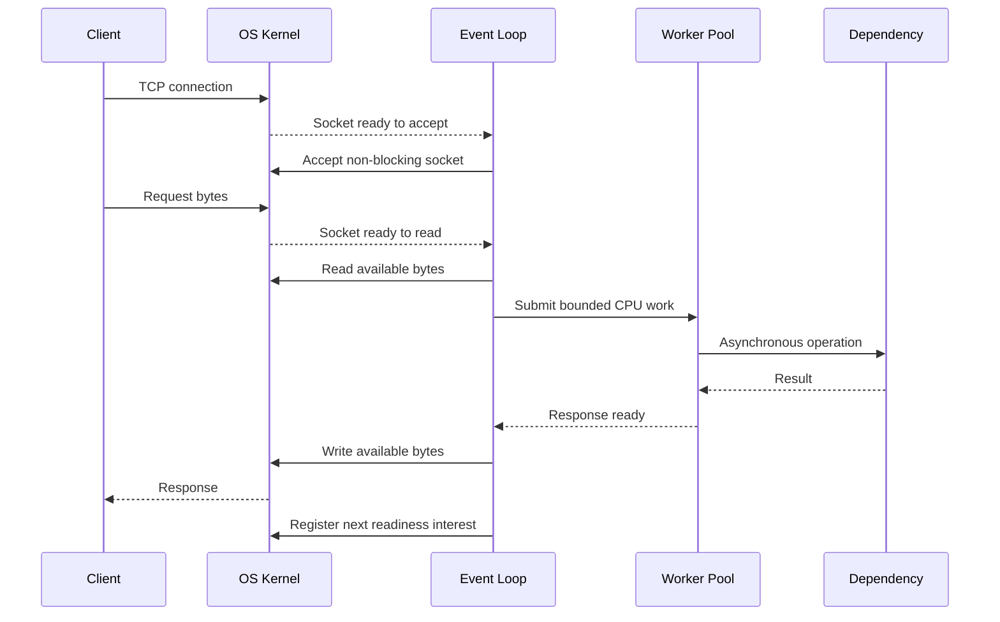

# C10K Problem

## What is the C10K Problem?

The C10K problem is the challenge of building a server that can keep 10,000 client connections open at the same time without exhausting memory, CPU, file descriptors, or operating-system networking resources. The term became important when the common thread-per-connection model stopped scaling as internet services grew.

C10K is about **concurrent connections**, not necessarily 10,000 requests per second. Most connections may be idle, occasionally sending a small message, while the server must remain responsive to every client.

Continue to the larger-scale version: [C1M Problem](c1m-problem.md).

## Why the Traditional Model Fails

A blocking server commonly assigns one process or thread to each connection:

```
Client 1 ──▶ Thread 1 ──▶ blocking read
Client 2 ──▶ Thread 2 ──▶ blocking read
Client 3 ──▶ Thread 3 ──▶ blocking read
   ...           ...
Client N ──▶ Thread N ──▶ blocking read
```

At 10,000 connections this creates several problems:

- **Thread memory**: every thread needs a stack and runtime metadata
- **Context switching**: the scheduler spends more time switching threads and evicting CPU caches
- **File-descriptor limits**: each socket consumes a file descriptor
- **Blocking operations**: a slow client or dependency occupies a thread while doing no useful work
- **Lock contention**: shared queues, allocators, and application state become synchronization points
- **Kernel memory**: every TCP connection needs socket structures and send and receive buffers
- **Connection churn**: frequent handshakes and disconnects add CPU and kernel work

If each connection consumes only 1 MB of thread stack and application state, 10,000 connections require about 10 GB before payloads, caches, and kernel memory are counted.

## The Core Solution

The scalable model uses non-blocking sockets and a small number of event loops. A thread asks the operating system which sockets are ready, processes only those sockets, and never waits on an idle connection.

Common readiness mechanisms are:

- `epoll` on Linux
- `kqueue` on BSD and macOS
- IOCP on Windows
- `io_uring` on modern Linux

```
10,000 sockets
      │
      ▼
OS readiness mechanism
      │
      ▼
Small event-loop pool
      │
      ├──▶ parse request
      ├──▶ run bounded work
      └──▶ write response when ready
```

## Sequence Diagram



The event loop handles a connection only when the kernel reports useful work. It does not reserve one thread for the lifetime of the connection.

## Architecture

### Non-Blocking I/O

Socket reads and writes return immediately. If a socket cannot make progress, the event loop registers interest and moves to another connection.

### Event Multiplexing

One event loop monitors many sockets. The operating system returns only sockets that are ready, avoiding a scan across every open connection.

### Bounded Worker Pools

CPU-heavy or unavoidable blocking work runs outside the event loop. The pool and its queue must be bounded so overload produces backpressure or fast rejection instead of unbounded memory growth.

### Connection State Machines

Each connection stores a small state object describing protocol progress, input, output, deadlines, and authentication. The state machine resumes when another event arrives.

### Backpressure

A server must stop reading from a client or reject new work when downstream processing or outbound writes cannot keep up. Without backpressure, slow clients fill memory with queued responses.

See [Load Shedding, Backpressure, and Adaptive Concurrency](load-shedding-backpressure.md).

## Capacity Model

```
total memory = connections × memory per connection

10,000 × 8 KB  = about 80 MB
10,000 × 64 KB = about 640 MB
10,000 × 1 MB  = about 10 GB
```

Per-connection memory includes:

- Application connection state
- Input and output buffers
- Protocol parser state
- TLS session state
- Kernel socket structures
- TCP send and receive buffers

Reducing connection state and allocating buffers only when needed often matters more than optimizing request code.

## Operating-System Limits

The application cannot solve C10K alone. The host must also support the target connection count:

- Process and system-wide file-descriptor limits
- Listen backlog and accept queue capacity
- TCP memory limits
- Ephemeral ports for outbound connections
- Connection-tracking limits on firewalls and load balancers
- Keepalive, idle timeout, and half-open connection policies

Increasing limits without controlling memory, queues, and timeouts only moves the failure to another resource.

## Common Mistakes

- Using asynchronous handlers that call blocking database, DNS, file, or network operations
- Creating one thread, timer, or large buffer per connection
- Keeping unbounded request and response queues
- Letting slow clients retain large outbound buffers
- Measuring requests per second without measuring open connections
- Testing only steady connections and ignoring connect and disconnect storms
- Raising file-descriptor limits without budgeting kernel and application memory
- Running expensive work directly on an event-loop thread

## How to Test It

A useful C10K test holds at least 10,000 real connections while measuring:

- Successful open connections
- Connection establishment rate
- Request throughput
- p50, p95, p99, and maximum latency
- CPU usage and context switches
- Application and kernel memory
- File-descriptor count
- Event-loop delay
- Queue depth and rejected work
- Disconnect and reconnect behavior

The test should include idle connections, active connections, slow readers, slow writers, abrupt disconnects, and dependency latency. Reaching 10,000 sockets is not success if latency collapses or the server cannot recover after churn.

## Pros of the Event-Driven Model

- Small number of threads for many connections
- Lower stack memory and scheduler overhead
- Better CPU-cache locality
- Explicit control of connection state and backpressure
- Predictable resource bounds when queues and buffers are limited

## Cons of the Event-Driven Model

- State machines and cancellation are more complex than sequential blocking code
- A blocking operation can stall many connections on the same event loop
- CPU-heavy work still needs isolation and bounded concurrency
- Debugging asynchronous control flow can be harder
- Kernel, runtime, framework, and application limits must be tuned together

## C10K and C1M

C10K established the scalable pattern: non-blocking I/O, event multiplexing, small connection state, bounded work, and backpressure. The [C1M Problem](c1m-problem.md) applies the same pattern at 100 times the connection count, where memory density, multi-core coordination, network infrastructure, and operational behavior become dominant constraints.
