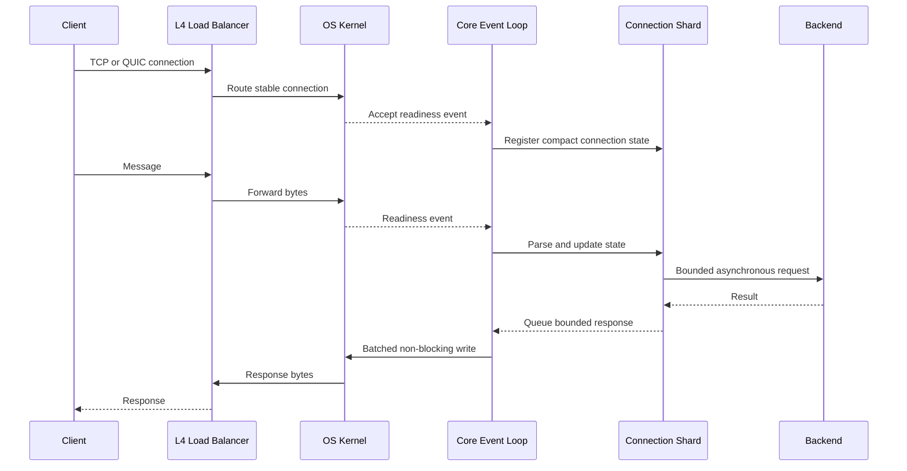

# C1M Problem

## What is the C1M Problem?

The C1M problem is the challenge of maintaining 1,000,000 concurrent client connections while preserving useful throughput, bounded latency, and predictable resource consumption. It extends the [C10K Problem](c10k-problem.md) from event-driven socket handling into a full capacity-engineering problem across the application, operating system, network, load balancers, and downstream services.

C1M is about **one million open connections**, not necessarily one million requests per second. The workload must state how many connections are idle, how often they send data, payload size, connection lifetime, and connection churn.

## Why C10K Techniques Are Not Enough

Non-blocking I/O is required, but at one million connections small costs become large:

- 1 KB per connection becomes about 1 GB
- 8 KB per connection becomes about 8 GB
- 64 KB per connection becomes about 64 GB
- One periodic timer per connection creates one million scheduled timers
- One heartbeat every 30 seconds produces over 33,000 heartbeat events per second
- A coordinated reconnect can create hundreds of thousands of handshakes at once

The C1M limit is usually the combined result of memory, CPU, file descriptors, kernel socket state, TLS, network bandwidth, load-balancer capacity, and connection churn rather than one isolated setting.

## Architecture

```
Clients
   │
   ▼
Load balancer or L4 routing tier
   │
   ├──▶ Connection host 1 ──▶ event loops by CPU core
   ├──▶ Connection host 2 ──▶ event loops by CPU core
   ├──▶ Connection host 3 ──▶ event loops by CPU core
   └──▶ Connection host N ──▶ event loops by CPU core
                                  │
                                  ▼
                         bounded service calls
```

One machine can be used as a technical target, but a production design normally spreads connections across multiple hosts or cells. Distribution provides failure isolation, deployment safety, headroom, and recovery capacity.

## Sequence Diagram



Stable routing keeps the connection on the same host, and the host keeps its state on the same event loop or shard. This reduces locking, cache invalidation, and cross-core coordination.

## Core Design Principles

### Shard by CPU Core

Run a small number of event loops, usually aligned with CPU cores, and assign each connection to one loop for its lifetime. Keeping connection state local avoids shared locks and improves CPU-cache locality.

Linux `SO_REUSEPORT` can distribute accepted connections across listener sockets. The application can also use a dedicated acceptor that hands sockets to event loops, although handoff adds coordination.

### Keep Connection State Compact

Store only essential state per idle connection. Allocate large read and write buffers on demand, reuse them through bounded pools, and release them after activity. Avoid one thread, task stack, timer object, queue, or dependency connection per client.

### Bound Every Queue

Inbound messages, outbound messages, worker tasks, and backend calls need explicit limits. When a client is slower than the server, cap its pending output and disconnect or degrade it before one connection consumes unbounded memory.

### Batch Work

Process readiness events, reads, writes, timers, and messages in batches. Batching reduces system calls and synchronization overhead, but oversized batches can hurt tail latency by letting active connections monopolize an event loop.

### Use Coarse Timers

Group deadlines and heartbeats with timer wheels or buckets instead of maintaining an expensive independent scheduling structure for every connection.

### Separate Connection and Request Capacity

A server may hold one million mostly idle sockets but cannot allow all clients to start expensive work simultaneously. Admission control and adaptive concurrency must protect CPU and downstream services independently of the connection limit.

### Design for Reconnection Storms

Clients should reconnect with exponential backoff and jitter. Servers and load balancers need handshake rate limits, connection admission control, and spare capacity so a host failure does not overload the surviving hosts.

## Resource Budget

| Resource | Per-connection cost | Concern at 1M |
|----------|---------------------|---------------|
| File descriptor | One or more descriptors | Process and system limits |
| Application state | Protocol and session data | Heap size and garbage collection |
| Socket state | Kernel structures | Unsized kernel memory |
| TCP buffers | Send and receive capacity | Large reserved or committed memory |
| TLS | Session, keys, and buffers | Memory and handshake CPU |
| Timers | Idle timeout and heartbeat | Scheduling overhead |
| Outbound queue | Pending responses | Slow-reader memory growth |
| Load balancer | Connection tracking entry | Front-door capacity and failover |

A useful capacity equation is:

```
host memory budget =
    connection count × total bytes per connection
    + runtime heap
    + shared caches
    + kernel memory
    + safety headroom
```

The total must be measured under the real protocol and TLS configuration. Object counts, allocator fragmentation, garbage-collection metadata, and lazily allocated socket buffers make source-level estimates incomplete.

## Operating-System and Network Concerns

- File-descriptor limits must exceed sockets plus logs, files, and outbound connections
- TCP send and receive buffer policy must fit the memory budget
- Listen and accept queues must absorb expected bursts
- Network devices must hold the required connection-tracking state
- NAT gateways and proxies must have enough state and port capacity
- Keepalive and idle timeouts must agree across clients, servers, and intermediaries
- NIC queues, receive-side scaling, and CPU affinity must distribute packet processing
- TLS handshakes may require session resumption or controlled admission

Tuning a single host does not help if a firewall or load balancer expires idle connections, runs out of state, or concentrates all packets on one CPU queue.

## Failure Modes

### Slow Readers

A client receives data more slowly than the server produces it. Pending output grows until the per-connection limit is reached. The server must pause production, discard nonessential updates, or disconnect the client.

### Slow Writers

A client sends a request extremely slowly and retains parser and connection state. Minimum data rates, request deadlines, and input limits prevent this from becoming a resource-exhaustion attack.

### Reconnect Storms

A network event or host restart disconnects a large population. Immediate retries create synchronized TCP and TLS handshakes, saturating CPU and accept queues.

### Hot Shards

Uneven connection or message distribution overloads one event loop while other cores remain idle. Routing should account for both connection count and activity.

### Downstream Amplification

One client message can create multiple database or service calls. A million cheap connections can therefore generate an expensive backend spike. Bounded concurrency, caching, coalescing, and load shedding protect dependencies.

### Garbage-Collection Pauses

Millions of connection objects and buffers increase heap pressure. Compact long-lived state, fewer allocations, and bounded buffer reuse reduce pause and scan costs.

## How to Test It

A C1M test must verify more than the socket count:

- Gradual ramp to one million established connections
- Stable memory per connection over time
- Idle, active, and mixed traffic distributions
- Message latency at p50, p95, p99, and p99.9
- Event-loop delay and fairness across shards
- Connection and TLS handshake rate
- File descriptors and kernel socket memory
- Packet rate, bandwidth, retransmissions, and drops
- Slow-reader and slow-writer behavior
- Dependency concurrency and queue depth
- Load-balancer and connection-tracking utilization
- Host loss followed by reconnect and redistribution
- Graceful restart and deployment behavior

Load generators are part of the capacity plan. Generating one million connections often requires multiple source machines because clients also consume file descriptors, memory, CPU, and source ports.

## Common Mistakes

- Treating one million accepted sockets as proof of a working service
- Using average memory or latency while ignoring worst-case behavior
- Allocating full-sized buffers for idle connections
- Creating one operating-system thread per connection
- Allowing unlimited outbound data for slow clients
- Running blocking operations on event-loop threads
- Ignoring TLS handshake CPU and reconnection behavior
- Tuning only the application host and ignoring network intermediaries
- Testing with unrealistic idle sockets and no protocol traffic
- Running near the maximum without failover headroom

## C10K and C1M Comparison

| Aspect | C10K | C1M |
|--------|------|-----|
| Concurrent connections | 10,000 | 1,000,000 |
| Primary transition | Threads to event-driven I/O | Event-driven I/O to strict resource engineering |
| Memory focus | Avoid thread stacks | Minimize every connection object and buffer |
| CPU focus | Reduce context switching | Preserve core locality, batching, and fairness |
| Network focus | Socket and descriptor capacity | Full path connection state and packet distribution |
| Failure focus | Blocking and unbounded queues | Reconnect storms, hot shards, and fleet failover |
| Deployment model | Often possible on one host | Usually distributed for reliability and headroom |

The [C10K Problem](c10k-problem.md) explains the foundation. C1M requires the same non-blocking model plus measured per-connection budgets, multi-core sharding, bounded buffers, infrastructure capacity, and failure-aware distribution.
